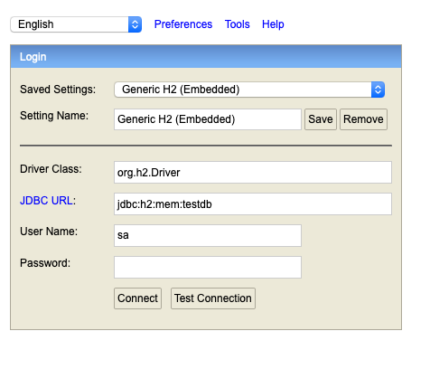

# Zendesk Code Challenge

**Instructions for building and executing this application**

Included in this repo is a locally runnable web application using SpringBoot 
and Maven as a build tool. This web application will allow a user to search 
for the "Organizations", "Users", and "Tickets" provided by the json files.

The json data provided for this project `organization.json`, `users.json`, and 
`tickets.json`, are deserialized into JPA objects and saved to an in memory
database (h2) at application start up.

Look at the following package to view the classes responsible for saving
the json data to the in memory database.

`com.zendesk.challenge.dataloader`

In order to verify the accuracy of the search results in this web application, any user
can query the in memory database, by visting the following url after application
start up.

`http://localhost:8080/h2-console`

After requesting this url you will be presented with a login screen like the one
below

the password is `sa`.

After logging in, you will then be able to query the User, Ticket, and Organization
tables using basic SQL. This might be helpful when trying to verify correctness
of the web application.

To run the tests for this project execute the following command at the root
of this project, just under the "challenge folder"

`mvn test;`

To build this project execute the following command

`mvn package;`

To run the web application execute

`mvn spring-boot:run`

To use the web application, visit

`localhost:8080/`

Click the "Organizations" button to search for organizations.

Click the "Users" button to search for users.

Click the "Tickets" button to search for tickets.

All subsequent pages will contain drop down menus containing the fields
one can search by and a text box where one can input a value. For searching by 
fields such as "tags" and "domains", one will have to input the value into the 
text box, as a comma separated string, with no spaces.

For searching by fields that constitue dates such as "createdDate", "lastLoginDate",
and "dueDate", I would recommend, first querying by id. On the results page
copy the date field you wish to search by, go back to the search page,
select your date field, and then paste in the value.

